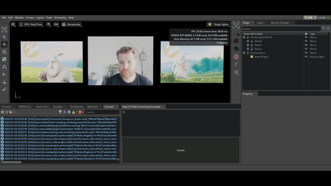

# kit-cv-video-example

Example Omniverse Kit extension that demonstrates how to stream video (webcam, RTSP, mp4, mov, ) to a dynamic texture using [OpenCV VideoCapture](https://docs.opencv.org/3.4/dd/d43/tutorial_py_video_display.html) and [omni.ui.DynamicTextureProvider](https://docs.omniverse.nvidia.com/kit/docs/omni.ui/latest/omni.ui/omni.ui.ByteImageProvider.html#byteimageprovider).



For a basic example of how to use `omni.ui.DynamicTextureProvider`, please see <https://github.com/jshrake-nvidia/kit-dynamic-texture-example>.

**WARNING**: This is a prototype and is not necessarily ready for production use. The performance of this example may not meet your performance requirements and is not optimized. This example is a temporary solution until a more mature and optimized streaming solution becomes available in the platform. This example currently only scales to a very limited number of low resolution streams.

## Getting Started

- Requires Kit 104.1 >=
- Tested in Create 2022.3.1, 2022.3.3

```
./link_app.bat --app create
./app/omni.create.bat --/rtx/ecoMode/enabled=false --ext-folder exts --enable omni.cv-video.example
```

Make sure that eco mode is disabled under Render Settings > Raytracing.

From the extension UI window, update the URI and click the Create button. A plane prim will be created at (0, 0, 0) with an OmniPBR material containing a dynamic video stream for the albedo texture. The extension should support whatever the OpenCV VideoCapture API supports.

Here are a few URIs you can use to test:

- Your own web camera: `0`
- HLS: `https://test-streams.mux.dev/x36xhzz/x36xhzz.m3u8`
- RTSP: `rtsp://wowzaec2demo.streamlock.net/vod/mp4:BigBuckBunny_115k.mp4`

